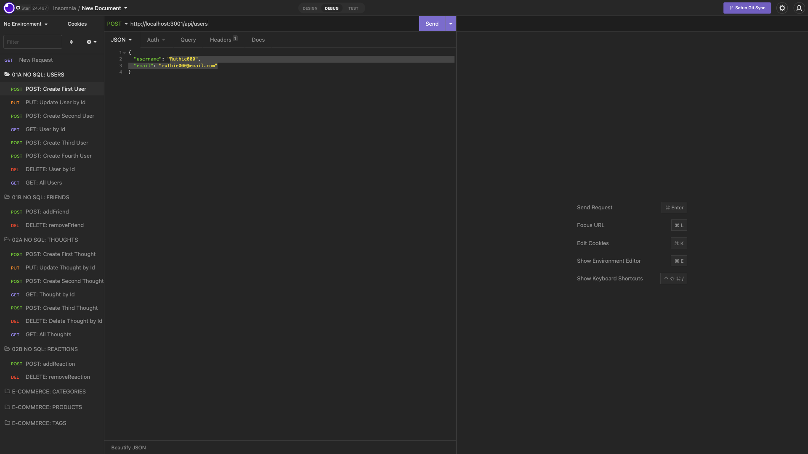

# Social-Network-with-Mongoose-Express

## Work Reference

* Challenge Template: 18-NoSQL/01-Activities/28-Stu_Mini-Project
* Virtuals: 18-NoSQL/01-Activities/21-Ins_Virtuals
* [$push vs $addToSet](https://stackoverflow.com/questions/27248556/mongodb-difference-between-push-addtoset)
* [Mongoose vs MongoDB](https://www.mongodb.com/developer/languages/javascript/mongoose-versus-nodejs-driver/)
* [Email Address Validation](https://www.w3docs.com/snippets/javascript/how-to-validate-an-e-mail-using-javascript.html)

## User Story

```md
AS A coding bootcamp student who wants to keep in touch with her classmates
I WANT an API for my coding social network that uses a NoSQL database utilizing Mongoose/MongoDB than mySQL/Sequelize
SO THAT my coding social network application manages large amounts of unstructured data utilizing Express
```
## Acceptance Criteria

```md
GIVEN a coding social network API
WHEN I enter npm start or nodemon index.js in my terminal
THEN my Mongoose models properly show in MongoDB according to my congruent setup in my server
WHEN I open my Insomnia
THEN I am able to easily access routes according to the preexisting proper folder structure set up in Insomnia resembling the mockup
WHEN I open API GET users and thoughts 
THEN the users and thoughts data display in respective routes in proper JSON format
WHEN I test CRUD functionality for users and thoughts
THEN I am able to successfully POST, PUT, and DELETE users and thoughts in Insomnia
WHEN I test CREATE and DELETE functionalities for reactions and friends
THEN I am able to perform POST and DELETE for the aforementioned in Insomnia as well
WHEN I test DELETE functionality to delete a user's associated thoughts 
THEN I am able to successfully DELETE the user as well 
```

## Screenshot

* Insomnia Screenshot below:
  
  
* MongoDB - proof of new database called networkDB (empty without seeded/testing data for now):
  

* MongoDB - proof of new database with thoughts and users (empty without seeded/testing data for now):
  >

## URL

* [GitHub Repository](https://github.com/leanonruthie/Social-Network-with-Mongoose-Express.git)
* Video Demo seen below:

https://user-images.githubusercontent.com/107362875/200081876-f6fde497-fb39-4e80-94d5-2ee875c5bcff.mp4

